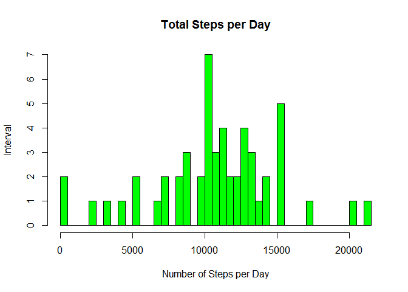
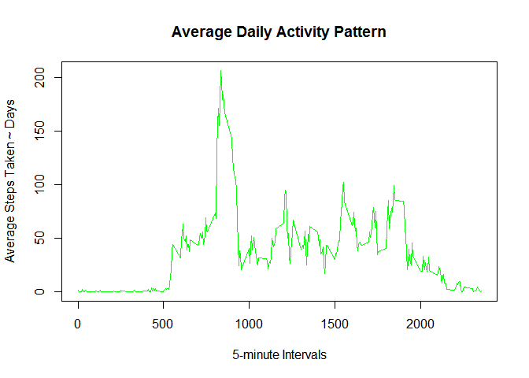
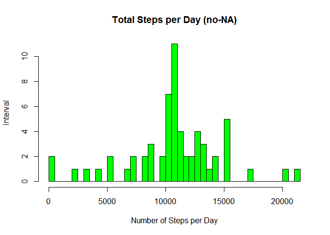
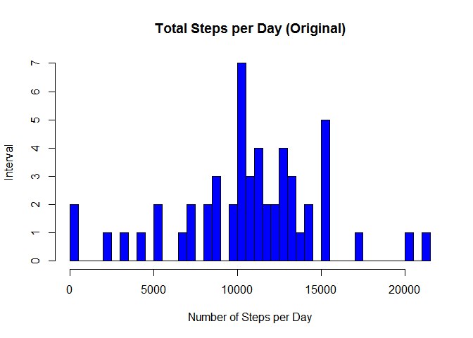
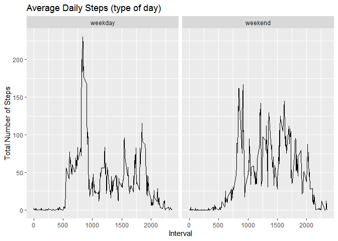

# 1. Loading libraries


```r
library(knitr)
library(ggplot2)
library(dplyr)
```

```
## 
## Attaching package: 'dplyr'
```

```
## The following objects are masked from 'package:stats':
## 
##     filter, lag
```

```
## The following objects are masked from 'package:base':
## 
##     intersect, setdiff, setequal, union
```

```r
library(plyr)
```

```
## ------------------------------------------------------------------------------
```

```
## You have loaded plyr after dplyr - this is likely to cause problems.
## If you need functions from both plyr and dplyr, please load plyr first, then dplyr:
## library(plyr); library(dplyr)
```

```
## ------------------------------------------------------------------------------
```

```
## 
## Attaching package: 'plyr'
```

```
## The following objects are masked from 'package:dplyr':
## 
##     arrange, count, desc, failwith, id, mutate, rename, summarise,
##     summarize
```


# 2. Showing all code chunks


```r
knitr::opts_chunk$set(echo = TRUE)
```


# 3. Loading and preprocessing the data 

Unzip 'activity.zip' from the respository aldalle/RepData_PeerAssessment1 on Github to your working directory.

```r
activity1 <- read.csv("activity.csv", header=T)
```


# 4.What is mean total number of steps taken per day?
### 4.1. Calculate the total number of steps taken per day.


```r
totalstepsperday1 <- aggregate(steps ~ date, data = activity1, FUN = sum, na.rm = TRUE)
head(totalstepsperday1)
```

```
##         date steps
## 1 2012-10-02   126
## 2 2012-10-03 11352
## 3 2012-10-04 12116
## 4 2012-10-05 13294
## 5 2012-10-06 15420
## 6 2012-10-07 11015
```

### 4.2. If you do not understand the difference between a histogram and a barplot, research the difference between them. Make a histogram of the total number of steps taken each day.

Converting dates to Y-M-D format

```r
activity1$date <- as.Date(activity1$date, "%Y-%m-%d")
```

Calculate steps as it relates to date using SUM (per day)

```r
hist(totalstepsperday1$steps, 
    main="Total Steps per Day", 
    xlab="Number of Steps per Day", 
    ylab = "Interval",
    col="green",
    breaks=50)
```

<!-- -->


### 4.3. Calculate and report the mean and median of the total number of steps taken per day.
Mean of total steps per day

```r
msteps <- mean(totalstepsperday1$steps)
msteps
```

```
## [1] 10766.19
```

Median of total steps per day

```r
medsteps <- median(totalstepsperday1$steps)
medsteps
```

```
## [1] 10765
```


# 5. What is the average daily activity pattern?
### 5.1. Make a time series plot (i.e. \color{red}{\verb|type = "l"|}type = "l") of the 5-minute interval (x-axis) and the average number of steps taken, averaged across all days (y-axis).
Five minute average using steps to interval - FUN = mean instead of sum

```r
fivemin1 <- aggregate(steps ~ interval, data = activity1, FUN = mean, na.rm = TRUE)
```

Line chart

```r
plot(x = fivemin1$interval, 
    y = fivemin1$steps, 
    type = "l", 
    col = "green",
    xlab = "5-minute Intervals",
    ylab = "Average Steps Taken ~ Days",
    main = "Average Daily Activity Pattern")
```

<!-- -->

### 5.2. Which 5-minute interval, on average across all the days in the dataset, contains the maximum number of steps?

```r
maxsteps <- fivemin1$interval[which.max(fivemin1$steps)]
maxsteps
```

```
## [1] 835
```


# 6. Imputing missing values
### 6.1. Calculate and report the total number of missing values in the dataset (i.e. the total number of rows with \color{red}{\verb|NA|}NAs)

Total number of missing values before filling

```r
sum(is.na(activity1))
```

```
## [1] 2304
```

### 6.2. Devise a strategy for filling in all of the missing values in the dataset. The strategy does not need to be sophisticated. For example, you could use the mean/median for that day, or the mean for that 5-minute interval, etc. Create a new dataset that is equal to the original dataset but with the missing data filled in.

Filling missing values in the new dataset

```r
activity2 <- activity1
nas <- is.na(activity2$steps)
avg_interval <- tapply(activity2$steps, activity2$interval, mean, na.rm=TRUE, simplify = TRUE)
activity2$steps[nas] <- avg_interval[as.character(activity2$interval[nas])]
```

Total number of missing values after filling

```r
sum(is.na(activity2))
```

```
## [1] 0
```


### 6.3. Make a histogram of the total number of steps taken each day and Calculate and report the mean and median total number of steps taken per day. Do these values differ from the estimates from the first part of the assignment? What is the impact of imputing missing data on the estimates of the total daily number of steps?
Calculate the total number of steps taken per day for the new dataset (without NAs)

```r
totalstepsperday2 <- aggregate(steps ~ date, data = activity2, FUN = sum, na.rm = TRUE)
head(totalstepsperday2)
```

```
##         date    steps
## 1 2012-10-01 10766.19
## 2 2012-10-02   126.00
## 3 2012-10-03 11352.00
## 4 2012-10-04 12116.00
## 5 2012-10-05 13294.00
## 6 2012-10-06 15420.00
```

Histogram without the NA values (new dataset = activity2)

```r
hist(totalstepsperday2$steps, 
    main = "Total Steps per Day (no-NA)", 
    xlab = "Number of Steps per Day", 
    ylab = "Interval",
    col="green",
    breaks=50)
```

<!-- -->

Histogram with the NA values (orginal dataset = activity1)

```r
hist(totalstepsperday1$steps, 
    main="Total Steps per Day (Original)", 
    xlab="Number of Steps per Day", 
    ylab = "Interval",
    col="blue",
    breaks=50)
```

<!-- -->

Summary of the impact of imputing data

```r
summary(totalstepsperday1)
```

```
##      date               steps      
##  Length:53          Min.   :   41  
##  Class :character   1st Qu.: 8841  
##  Mode  :character   Median :10765  
##                     Mean   :10766  
##                     3rd Qu.:13294  
##                     Max.   :21194
```

```r
summary(totalstepsperday2)
```

```
##       date                steps      
##  Min.   :2012-10-01   Min.   :   41  
##  1st Qu.:2012-10-16   1st Qu.: 9819  
##  Median :2012-10-31   Median :10766  
##  Mean   :2012-10-31   Mean   :10766  
##  3rd Qu.:2012-11-15   3rd Qu.:12811  
##  Max.   :2012-11-30   Max.   :21194
```


# 7. Are there differences in activity patterns between weekdays and weekends?
### 7.1. Create a new factor variable in the dataset with two levels – “weekday” and “weekend” indicating whether a given date is a weekday or weekend day.
Create new column 'type of day': weekend/weekday

```r
Sys.setlocale("LC_ALL", "English")
```

```
## [1] "LC_COLLATE=English_United States.1252;LC_CTYPE=English_United States.1252;LC_MONETARY=English_United States.1252;LC_NUMERIC=C;LC_TIME=English_United States.1252"
```

```r
activity2$date <- as.Date(activity2$date)
activity2$days=tolower(weekdays(activity2$date))
activity2$day_type<-ifelse(activity2$days=="saturday"|activity2$days=="sunday","weekend","weekday")
```

### 7.2. Make a panel plot containing a time series plot (i.e. \color{red}{\verb|type = "l"|}type = "l") of the 5-minute interval (x-axis) and the average number of steps taken, averaged across all weekday days or weekend days (y-axis). See the README file in the GitHub repository to see an example of what this plot should look like using simulated data.
Five minute average using steps to interval - FUN = mean instead of sum

```r
fivemin2 <-aggregate(activity2$steps,by=list(activity2$interval,activity2$day_type),FUN=mean,na.rm=TRUE)
colnames(fivemin2)<-c("interval","day_type","steps")
head(fivemin2)
```

```
##   interval day_type      steps
## 1        0  weekday 2.25115304
## 2        5  weekday 0.44528302
## 3       10  weekday 0.17316562
## 4       15  weekday 0.19790356
## 5       20  weekday 0.09895178
## 6       25  weekday 1.59035639
```

Line chart

```r
ggplot(aes(x=interval,y=steps),data=fivemin2) + 
      geom_line() +
      labs(title = "Average Daily Steps (type of day)", x = "Interval", y = "Total Number of Steps")  +
      facet_wrap(~fivemin2$day_type)
```

<!-- -->

